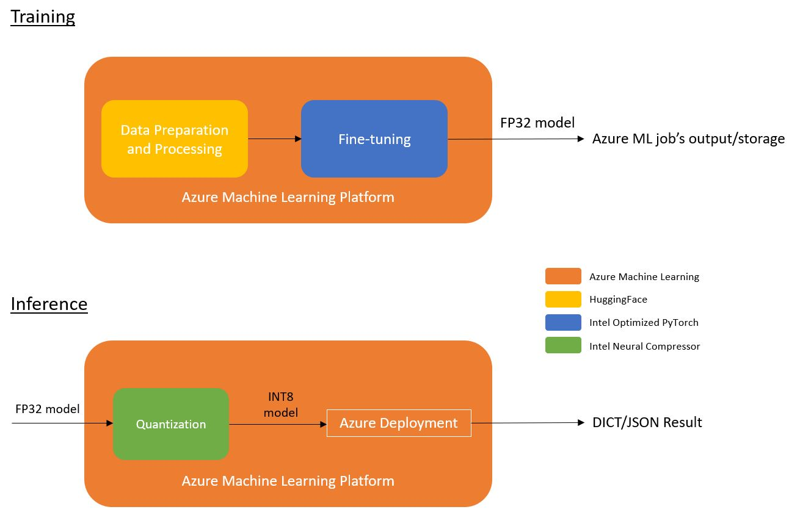

# Intel® NLP workflow for Azure* ML

This is a workflow to demonstrate how users utilize the Intel’s XPU hardware (e.g.: CPU - Ice Lake or above) and related optimized software to perform distributed training and inference on Azure Machine Learning Platform. The main software packages used here are: Intel Extension for PyTorch, PyTorch, HuggingFace, Azure Machine Learning Platform and Intel Neural Compressor

## Table of Contents 
- [Implementation Details](#implementation-details)
    - [Architecture](#architecture)
    - [Model Spec](#model-spec)
    - [Dataset](#dataset)
- [Getting Started](#installation)
    - [Prerequisites](#prerequisites)
    - [Installation](#installation)
- [Usage](#usage)
    - [Training](#training)
    - [Inference](#inference)
- [License](#license)

## Implementation Details
This workflow ultilizes the infrastructure provided by the AzureML.

### Architecture 

AzureML:
<br>
<br>

<br>
<br>

### Model Spec
The uncased BERT base model is used to demonstrate this workflow.

```python
bert-base-uncased-config = {
  "architectures": [
    "BertForMaskedLM"
  ],
  "attention_probs_dropout_prob": 0.1,
  "gradient_checkpointing": false,
  "hidden_act": "gelu",
  "hidden_dropout_prob": 0.1,
  "hidden_size": 768,
  "initializer_range": 0.02,
  "intermediate_size": 3072,
  "layer_norm_eps": 1e-12,
  "max_position_embeddings": 128,
  "model_type": "bert",
  "num_attention_heads": 12,
  "num_hidden_layers": 12,
  "pad_token_id": 0,
  "position_embedding_type": "absolute",
  "transformers_version": "4.21.1",
  "type_vocab_size": 2,
  "use_cache": true,
  "vocab_size": 30522
}
```

### Dataset 
Microsoft Research Paraphrase Corpus is used as the dataset for training and testing. 

| **Type**                 | **Format** | **Rows** 
| :---                     | :---       | :---     
| Training Dataset         | HuggingFace Dataset  | 3668
| Testing  Dataset         | HuggingFace Dataset  | 1725

## Getting Started
### Prerequisites
#### Hardware
| **Name**                          | **Description**
| :---                              | :---
| CPU                               | Intel CPU - Ice Lake or above
| Usable RAM                        | 16 GB
| Disk Size                         | 256 GB

#### Software
Docker is required to start this workflow. You will also need Azure credentials to perform any training/inference related operations.

For setting up the Azure Machine Learning Account, you may refer to the following link:
<br>
https://azure.microsoft.com/en-us/free/machine-learning

For configuring the Azure credentials using the Command-Line Interface, you may refer to the following link:
<br>
https://docs.microsoft.com/en-us/cli/azure/authenticate-azure-cli

The following two websites listed out the availability and type of the instances for users. Users may based on their needs and the region to choose appropriate instances:
<br>
https://learn.microsoft.com/en-us/azure/machine-learning/concept-compute-target
<br>
https://azure.microsoft.com/en-us/explore/global-infrastructure/products-by-region/?products=virtual-machines&regions=us-east

### Installation
1. Clone the repository
```
git clone https://github.com/intel/Intel-NLP-workflow-for-Azure-ML.git
cd applications.ai.appliedml.workflow.azureml
```
2. Build the docker image to prepare the environment for running the Juypter notebooks.
```
cd scripts
sh build_main_image.sh
```

## Usage 
Use the built docker image (by build_main_image.sh) to run the Juypter notebooks. Execute the following command:
```bash
sh start_script.sh
```

### Training 
After starting the container (i.e. executing the step in 'Usage'), execute the following command in the interactive shell.
```bash
cd /root/notebooks
jupyter notebook --allow-root
```
Start the notebook that is named as training.

### Inference
After starting the container (i.e. executing the step in 'Usage'), execute the following command in the interactive shell.
```bash
cd /root/notebooks
jupyter notebook --allow-root
```
Start the notebook that is named as inference.

## License 

[License](LICENSE)
